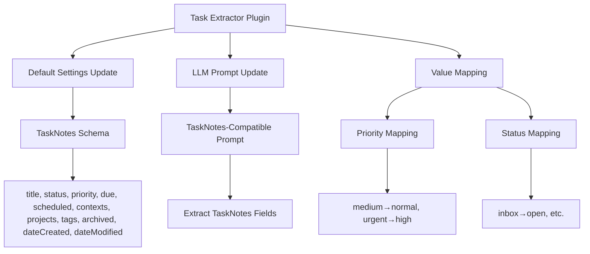
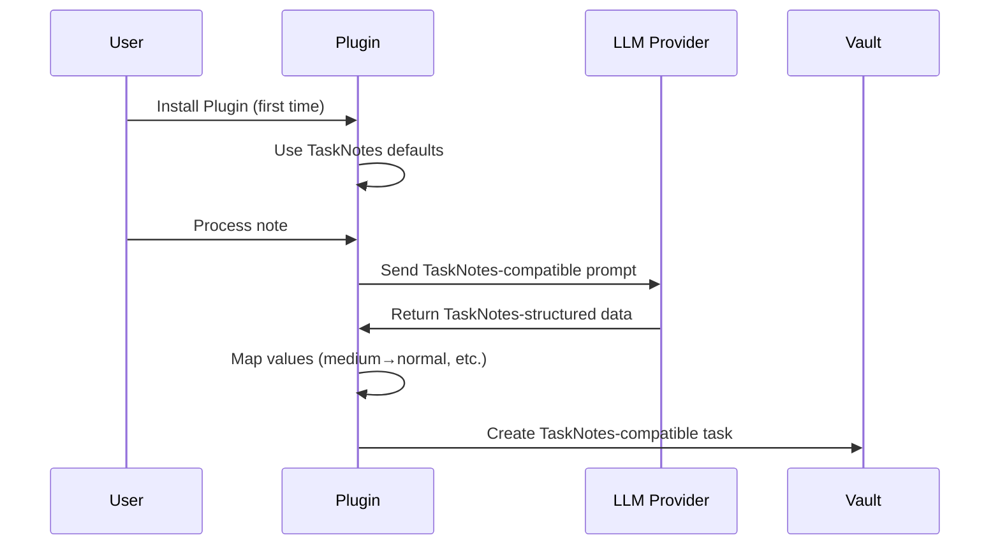

# Design Document

## Overview

This design implements TaskNotes compatibility for the Task Extractor plugin by simply changing the default frontmatter schema and LLM prompts to match TaskNotes expectations. The approach is minimal and leverages the existing plugin architecture.

The solution centers around three simple changes:
1. **Update Default Fields**: Change DEFAULT_FRONTMATTER_FIELDS to TaskNotes schema
2. **Update LLM Prompt**: Modify extraction prompt for TaskNotes fields and values
3. **Add Value Mapping**: Map legacy values to TaskNotes-compatible ones

## Architecture

### High-Level Architecture



### Simple Flow



## Components and Interfaces

### 1. Updated Default Frontmatter Fields

Simply replace the existing `DEFAULT_FRONTMATTER_FIELDS` constant with TaskNotes-compatible fields:

```typescript
export const DEFAULT_FRONTMATTER_FIELDS: FrontmatterField[] = [
  { key: 'title', defaultValue: '', type: 'text', required: true },
  { key: 'status', defaultValue: 'open', type: 'select', options: ['open', 'in-progress', 'done'], required: true },
  { key: 'priority', defaultValue: 'normal', type: 'select', options: ['low', 'normal', 'high'], required: true },
  { key: 'due', defaultValue: '', type: 'date', required: false },
  { key: 'scheduled', defaultValue: '', type: 'date', required: false },
  { key: 'contexts', defaultValue: '', type: 'text', required: false },
  { key: 'projects', defaultValue: '', type: 'text', required: false },
  { key: 'tags', defaultValue: '', type: 'text', required: false },
  { key: 'archived', defaultValue: 'false', type: 'boolean', required: false },
  { key: 'dateCreated', defaultValue: '{{date}}', type: 'date', required: true },
  { key: 'dateModified', defaultValue: '{{date}}', type: 'date', required: true }
];
```

### 2. Value Mapping in Task Processing

Add simple value mapping in the `extractFieldValue` method:

```typescript
private mapValueForTaskNotes(value: any, fieldKey: string): any {
  // Priority mapping
  if (fieldKey === 'priority' && typeof value === 'string') {
    const priorityMap = {
      'urgent': 'high',
      'medium': 'normal'
    };
    return priorityMap[value.toLowerCase()] || value;
  }
  
  // Status mapping (if needed)
  if (fieldKey === 'status' && typeof value === 'string') {
    const statusMap = {
      'inbox': 'open',
      'next': 'open',
      'waiting': 'open',
      'someday': 'open',
      'cancelled': 'done'
    };
    return statusMap[value.toLowerCase()] || value;
  }
  
  return value;
}
```

### 3. Updated LLM Prompt

Replace the default prompt to extract TaskNotes fields:

```typescript
export const DEFAULT_EXTRACTION_PROMPT = `You are an expert task extraction specialist focused on identifying actionable items from notes, emails, and meeting records. Your role is to systematically analyze content and extract only legitimate, actionable tasks with accurate contextual metadata.

## ANALYSIS FRAMEWORK

### STEP 1: Context Analysis
- Identify the document type (meeting notes, email, project notes, etc.)
- Locate mentions of the target person: {ownerName}
- Map any project/client references for proper categorization
- Note any explicit dates, deadlines, or time references

### STEP 2: Task Identification
Apply these strict criteria for actionable tasks:
- Contains a specific verb indicating action (schedule, create, review, send, complete, etc.)
- Has a clear, measurable outcome or deliverable
- Is explicitly assigned to or requested from {ownerName}
- Is realistic and feasible (not aspirational goals or ideas)

### STEP 3: Information Extraction
For each valid task, extract:
- **task_title**: Concise action-oriented title (6-100 chars) using active verbs
- **task_details**: Specific context and requirements (1-3 sentences, max 300 chars)
- **due_date**: Only extract if explicitly stated as YYYY-MM-DD, otherwise null
- **scheduled_date**: Date when task should be worked on (YYYY-MM-DD), otherwise null
- **priority**: Based on context clues:
  - high: explicit urgency, "ASAP", "urgent", specific deadlines, escalations
  - normal: standard business requests, regular follow-ups
  - low: optional items, "when you have time", suggestions
- **projects**: Array of project names if explicitly mentioned, otherwise empty array
- **contexts**: Array of contexts (work environment, tools, people) if mentioned, otherwise empty array
- **source_excerpt**: Exact quote (max 150 chars) that justifies the task extraction
- **confidence**: Your assessment of extraction accuracy:
  - high: clearly stated task with explicit assignment
  - medium: reasonably implied task with good context
  - low: ambiguous but likely actionable item

## OUTPUT FORMAT

Return valid JSON in this exact structure:

{
  "found": boolean,
  "tasks": [
    {
      "task_title": "string (6-100 chars, action-oriented)",
      "task_details": "string (max 300 chars, specific context)",
      "due_date": "YYYY-MM-DD or null",
      "scheduled_date": "YYYY-MM-DD or null",
      "priority": "high|normal|low",
      "projects": ["string"] or [],
      "contexts": ["string"] or [],
      "source_excerpt": "string (exact quote, max 150 chars)",
      "confidence": "high|medium|low"
    }
  ],
  "confidence": "high|medium|low (overall extraction confidence)"
}

When no actionable tasks are found, return: {"found": false, "tasks": []}
`;
```

## Data Models

### Updated Extraction Result
The existing `ExtractedTask` interface needs minor updates to support new fields:

```typescript
export interface ExtractedTask {
  task_title: string;
  task_details: string;
  due_date?: string | null;
  scheduled_date?: string | null;  // New field
  priority?: 'high' | 'normal' | 'low';  // Updated values
  projects?: string[];             // Changed from string to array
  contexts?: string[];             // New field (replaces client)
  source_excerpt?: string;
  confidence?: 'high' | 'medium' | 'low';
  [key: string]: any;
}
```

### Settings Preservation
No changes needed to `ExtractorSettings` - existing users' custom frontmatter fields will be preserved automatically.

## Error Handling

### Field Processing Errors
- **Array Field Parsing**: Handle both string and array inputs for contexts/projects
- **Priority Value Mapping**: Gracefully map unknown priority values to 'normal'
- **Date Format Validation**: Ensure YYYY-MM-DD format for date fields
- **Boolean Field Handling**: Handle string 'true'/'false' and boolean values for archived field

## Testing Strategy

### Unit Tests
1. **Default Fields Tests**
   - Verify new default frontmatter fields match TaskNotes schema
   - Test field validation and formatting

2. **Value Mapping Tests**
   - Test priority mapping (medium→normal, urgent→high)
   - Test status mapping if needed
   - Test array field handling for contexts/projects

3. **LLM Prompt Tests**
   - Verify prompt generates TaskNotes-compatible extraction requests
   - Test new field extraction (scheduled_date, contexts, projects)

### Integration Tests
1. **End-to-End Task Creation**
   - Create tasks with new TaskNotes schema
   - Verify frontmatter format matches TaskNotes expectations
   - Test with various extraction scenarios

2. **Backward Compatibility**
   - Ensure existing users with custom fields are unaffected
   - Test settings preservation during plugin updates

### Compatibility Tests
1. **TaskNotes Plugin Integration**
   - Verify created tasks work in TaskNotes views
   - Test field recognition and filtering
   - Validate array and boolean field formats